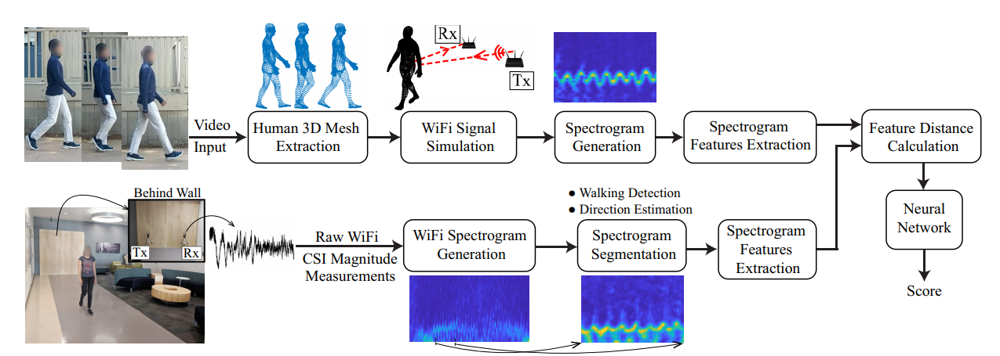
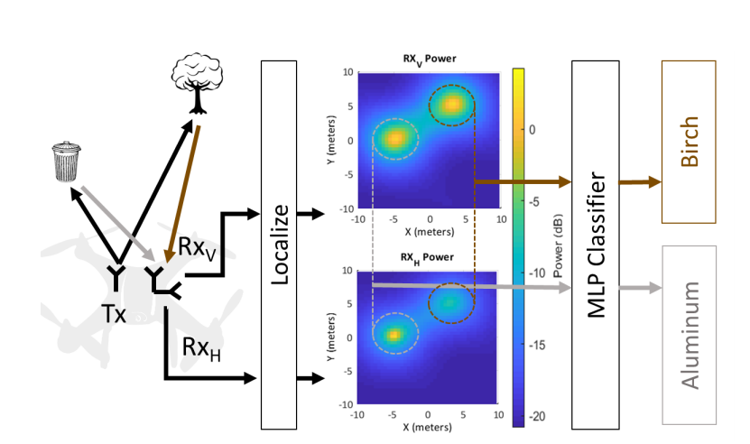
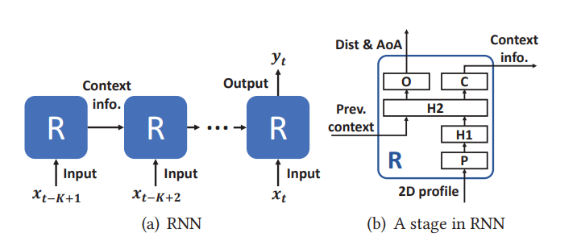

### XModal-ID: Using WiFi for Through-Wall Person Identification from Candidate Video Footage

This paper presents a novel WiFi-video cross-modal gait-based person identification system. Given the WiFi signal measured when an unknown person walks in an unknown area and a video footage of a walking person in another area, XModal-ID can determine whether it is the same person in both cases or not.

### On the Feasibility of Wi-Fi Based Material Sensing

Prior work in this space aims to merely detect the presence of objects around corners, rather than their type. In this paper, they explore the feasibility to detect both the location and type of targets based on the different transmission characteristics of wireless signal.

### RNN-Based Room Scale Hand Motion Tracking

This paper develops   a novel recurrent neural network (RNN) based system that uses speakers and microphones to realize accurate room-scale tracking. Our system jointly estimates the propagation distance and angle-of-arrival (AoA) of signals reflected by the hand, based on AoA-distance profiles generated by 2D MUSIC.

